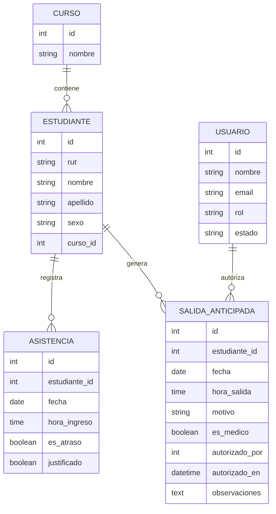

# Modelo de Datos Conceptual

## 1. Proposito

Este modelo describe las entidades principales del sistema y sus relaciones de negocio, sin entrar aun en detalles de implementacion fisica.

## 2. Entidades principales

### Curso
Representa una seccion academica dentro del establecimiento.

Atributos clave:
- id
- nombre

### Estudiante
Representa a una persona matriculada en un curso.

Atributos clave:
- id
- rut
- nombre
- apellido
- sexo
- curso_id

### Asistencia
Representa el ingreso diario de un estudiante.

Atributos clave:
- id
- estudiante_id
- fecha
- hora_ingreso
- es_atraso
- justificado

### Salida anticipada
Representa el retiro previo al termino de jornada.

Atributos clave:
- id
- estudiante_id
- fecha
- hora_salida
- motivo
- es_medico
- autorizado_por
- autorizado_en
- observaciones

### Usuario
Representa una cuenta con permisos para operar el sistema.

Atributos clave:
- id
- nombre
- email
- rol
- estado

## 3. Relaciones

- Un curso tiene muchos estudiantes
- Un estudiante pertenece a un curso
- Un estudiante tiene muchos registros de asistencia
- Un estudiante tiene muchas salidas anticipadas
- Un usuario puede autorizar muchas salidas anticipadas

## 4. Reglas de cardinalidad

- Curso 1 a N Estudiante
- Estudiante 1 a N Asistencia
- Estudiante 1 a N Salida anticipada
- Usuario 1 a N Salida anticipada autorizada

## 5. Restricciones conceptuales

- El curso debe ser unico por nombre
- El estudiante debe ser unico por documento
- Solo debe existir un evento de asistencia por estudiante y fecha
- Solo debe existir una salida anticipada por estudiante y fecha

## 6. Diccionario resumido

| Entidad | Descripcion | Uso principal |
| --- | --- | --- |
| Curso | Agrupacion academica | Ordenar estudiantes y reportes |
| Estudiante | Registro base del alumno | Vincular asistencia y salidas |
| Asistencia | Ingreso diario | Control de puntualidad |
| Salida anticipada | Retiro previo | Control y autorizacion |
| Usuario | Actor del sistema | Acceso y auditoria |

## 7. Diagrama ER conceptual

## 8. Observaciones de evolucion

En una siguiente fase pueden incorporarse:

- Historial de cambios por entidad
- Tabla de notificaciones
- Logs de auditoria separados
- Catalogos de motivos estandarizados
- Indicadores agregados por periodo
