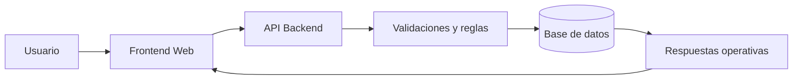
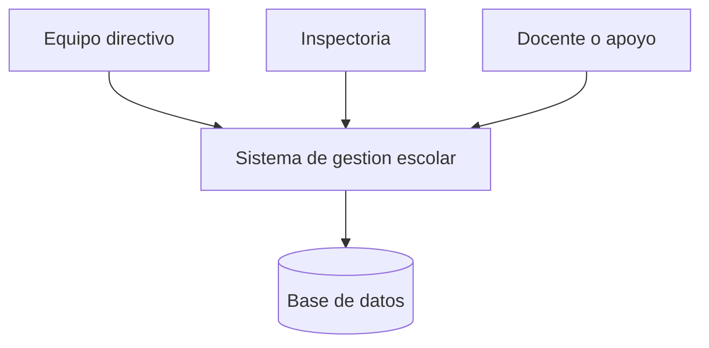
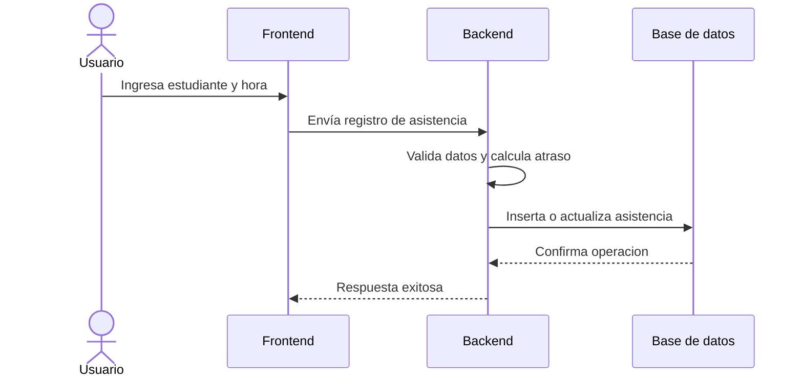
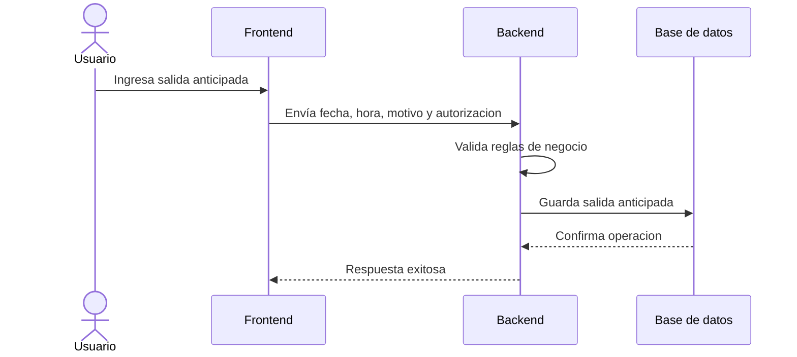

# Arquitectura y Diagramas

## 1. Arquitectura de alto nivel

La solucion se plantea como una aplicacion web de tres capas:

- Presentacion: interfaz web para usuarios finales
- Logica de negocio: API REST para reglas y validaciones
- Persistencia: base de datos relacional para informacion operativa

## 2. Componentes principales

### Frontend
- Pantallas de acceso y navegacion
- Vistas de cursos, estudiantes, asistencia, atrasos y salidas anticipadas
- Panel de resumen y acciones operativas

### Backend
- API REST
- Validacion de datos
- Reglas de negocio
- Autenticacion y autorizacion
- Enrutamiento por dominio funcional

### Base de datos
- Tablas normalizadas para entidades principales
- Restricciones de integridad
- Relaciones entre cursos, estudiantes y eventos

## 3. Principios arquitectonicos

- Separacion por dominios
- Validacion en servidor como fuente de verdad
- Consultas orientadas a operacion diaria
- Trazabilidad de acciones criticas
- Preparacion para evolucion a reportes y modulos adicionales

## 4. Flujo general del sistema

## 5. Diagrama de contexto

## 6. Secuencia conceptual: registrar asistencia

## 7. Secuencia conceptual: registrar salida anticipada

## 8. Frontend conceptual

Pantallas sugeridas:

- Login
- Dashboard
- Cursos
- Estudiantes
- Asistencia
- Atrasos
- Salidas anticipadas
- Usuarios

## 9. Backend conceptual

Modulos sugeridos:

- Autenticacion
- Cursos
- Estudiantes
- Asistencia
- Salidas anticipadas
- Dashboard
- Usuarios

## 10. Consideraciones tecnicas

- La API debe validar entrada en todos los endpoints mutables
- Las operaciones sensibles deben quedar protegidas por JWT o mecanismo equivalente
- Las relaciones entre estudiantes y eventos deben preservarse con claves foraneas
- La aplicacion debe devolver mensajes claros para soporte operativo

## 11. Riesgos arquitectonicos

- Crecimiento del volumen historico de registros
- Reglas de negocio no estandarizadas entre modulos
- Dependencia de procesos manuales al inicio
- Necesidad de reporting mas elaborado en etapas posteriores
